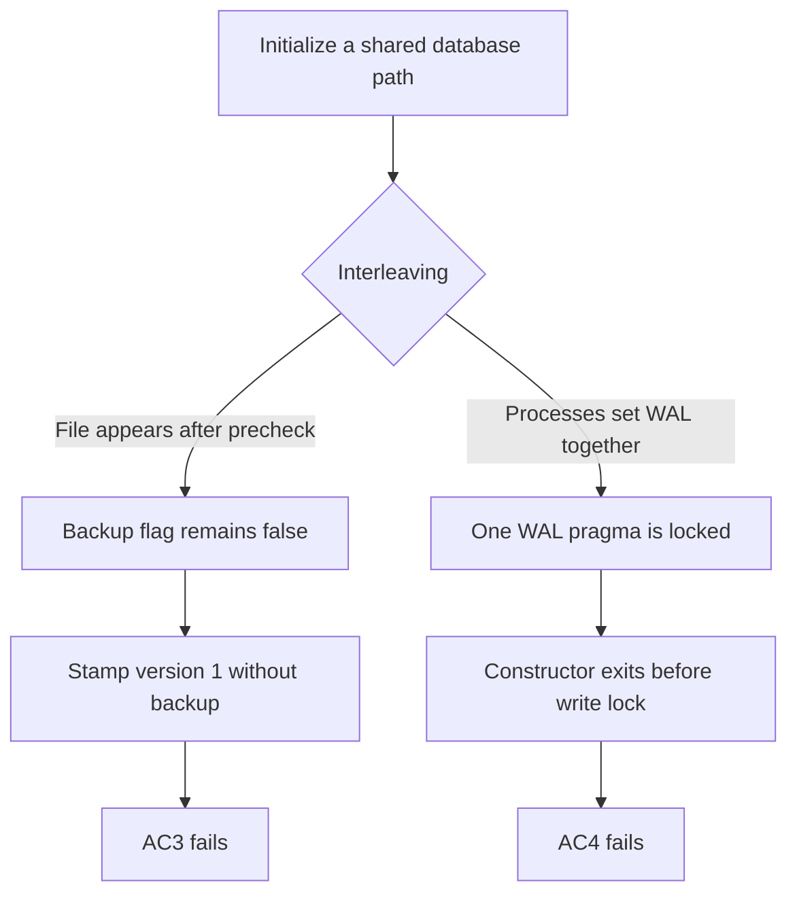

# T-004 Independent QA Evidence — Cycle 3

## Outcome

**Overall verdict: FAIL.** Cycle 3 closes the cycle-2 schema-comment bypass, but T-004 still fails AC3 and AC4. A deterministic interleaving migrated an existing legacy database without a backup, and one required Windows-spawn repetition lost a constructor to `database is locked` before SQLite-level migration serialization began.

T-004 must not move to `DONE`. The existing rejected-cycle record in `qa.md` remains unchanged; this file records only the authorized third cycle.

## Acceptance Verdicts

| Criterion | Verdict | Evidence |
| --- | --- | --- |
| AC1: operation-owned connections and pragmas | PASS | The named state tests observed fresh normally thread-affine connections with WAL, foreign keys `1`, and busy timeout `5000`; state and relevant regressions passed. |
| AC2: forward-only transactional versions | PASS | Exact legacy and current-v1 paths passed; malformed ledgers and schema spoofs failed closed; injected v1 migration failure rolled back. Future-version validation remains a documented limitation below. |
| AC3: pre-migration backup | FAIL | An exact legacy database injected after the file precheck but before connection opening was stamped version `1` with zero backups. |
| AC4: concurrency and rollback | FAIL | Rollback passed, but concurrency repetition 2 raised `sqlite3.OperationalError: database is locked` in one of four spawned constructors. |

## Blocking Mechanisms

Both failures occur before or outside the intended SQLite serialization point.



### AC3 — Backup Eligibility Race

`src/core/state_store.py:620` computes `preexisting_nonempty` before `_open_connection` at line 625 and before `BEGIN IMMEDIATE` at line 631. The backup decision at line 636 therefore uses a stale filesystem observation.

The independent diagnostic monkeypatched only the first `_open_connection` call. It created an exact nonempty legacy database in that gap, then delegated to the original method. All data was fake and the database lived under a disposable temporary directory.

```powershell
$qa | & .\.venv-py312\Scripts\python.exe -
```

```text
{"interleaving_injected": true, "ledger": [[1]], "preserved_items": [["LB-GAP", "before-migration"]], "preserved_tokens": [[1, "fake-gap-token"]], "backup_count": 0}
QA3_PREEXISTING_BACKUP_GAP_REPRODUCED
Exit code: 0
```

The migration succeeded and preserved the rows, but AC3 requires a backup before migrating an existing database. Zero backups is dispositive.

### AC4 — WAL Initialization Race

`src/core/state_store.py:476` executes `PRAGMA journal_mode = WAL` before `BEGIN IMMEDIATE` at line 631. In concurrency repetition 2, one spawned process failed at that pragma while the other three exited normally.

```text
Child exit codes: [0, 1, 0, 0]
Exception: sqlite3.OperationalError: database is locked
Location: src/core/state_store.py:476
Pytest result: 1 failed, 5 passed in 1.92 s
```

Read-only inspection after the failed run found ledger `[1]`, one item, one token, one readable pre-migration backup, and no partial backup. That limits corruption risk in this observation; it does not satisfy the requirement that concurrent constructors complete without lock errors. Builder passes and QA repetitions 1 and 3 do not negate the reproduced failure.

## Verification Record

### Core Gates

All pytest runs used distinct `--basetemp` paths and disabled repository cache state.

| Gate | Exact command | Result |
| --- | --- | --- |
| State target | `.\.venv-py312\Scripts\python.exe -m pytest -q -p no:cacheprovider -o addopts= --basetemp=.test-tmp\qa3-state-8bb1 tests\test_state_store.py` | Exit `0`; 32 passed in 1.14 s |
| Concurrency 1 | Same pytest options with `--basetemp=.test-tmp\qa3-concurrency-a1 tests\test_state_store_concurrency.py` | Exit `0`; 6 passed in 1.43 s |
| Concurrency 2 | Same pytest options with `--basetemp=.test-tmp\qa3-concurrency-b2 tests\test_state_store_concurrency.py` | Exit `1`; 1 failed and 5 passed in 1.92 s |
| Concurrency 3 | Same pytest options with `--basetemp=.test-tmp\qa3-concurrency-c3 tests\test_state_store_concurrency.py` | Exit `0`; 6 passed in 1.89 s |
| Relevant regression | Same pytest options with `--basetemp=.test-tmp\qa3-regression-d4` and state, concurrency, eBay auth, and orchestrator targets | Exit `0`; 70 passed in 3.61 s |
| Canonical verification | `powershell.exe -NoProfile -ExecutionPolicy Bypass -File scripts\verify.ps1` | Exit `0`; Python 3.12.10; `pip check` clean; 198 collected and passed |
| Patch and status hygiene | `git diff --check; git status --short --branch; git diff --stat; git diff --name-only; git ls-files --others --exclude-standard` | Exit `0`; line-ending warnings only; no visible cache, database, or build artifact |

### Schema-Adversarial Matrix

The independent standard-input diagnostics used SQLite 3.49.1, disposable databases, and fake rows. Each rejected path compared ledger, item, and token rows before and after validation.

| Case | Input | Result |
| --- | --- | --- |
| A | Required checks only inside block comments in both constrained tables | Rejected; rows and ledger unchanged |
| B | Line-comment-only and always-true string-literal checks | Both rejected; rows and ledger unchanged |
| C | Missing checks and correct checks plus extra constraints | Both rejected; rows and ledger unchanged |
| D | Quoted lowercase table and column identifiers | Rejected; rows and ledger unchanged |
| E | Exact canonical DDL with `PRAGMA ignore_check_constraints=ON` | Schema and token probes rejected; version `0` and token id `2` did not persist |
| F | Exact legacy migration and exact current-v1 reopen | Both accepted; legacy retained one backup; current rows remained unchanged |
| G | Successful enforcement validation on exact current schema | Accepted; ledger, item, and token rows remained unchanged |

Only `SQLITE_CONSTRAINT_CHECK` qualified as enforcement proof. A duplicate-primary-key rejection produced `StateStoreMigrationError` for an unexpected constraint reason. Direct canonicalizer comparisons also distinguished comments, quotes, literals, `STRICT`, `WITHOUT ROWID`, generated columns, and extra clauses from the frozen SQL.

The first independent harness completed cases A through E and G, then exited on a QA-only `sqlite3.Row` versus tuple assertion after product validation. The corrected remainder converted rows to tuples and exited `0`; no repository file or product state was changed by either harness.

### Backup and Rollback Checks

| Scenario | Exact command or observation | Result |
| --- | --- | --- |
| Normal legacy backup | State target plus current/legacy diagnostic | One readable backup; fake rows preserved; current-v1 reopen created none |
| Injected migration failure | Named backup/rollback pytest targets with `--basetemp=.test-tmp\qa3-backup-rollback-e5` | Exit `0`; 2 passed in 0.31 s; live schema rolled back and copied backup remained readable |
| Spawned migration | Three full concurrency repetitions | Runs 1 and 3 passed one-backup assertions; run 2 retained one readable backup but one constructor failed before the migration lock |

## Cycle History

| Cycle | Evidence-based disposition |
| --- | --- |
| 1 | Rejected for schema drift, keeper lifecycle, backup lock point, WAL verification, and process coverage gaps. |
| 2 | Rejected because comment-only constraint text passed substring validation; preserved in `qa.md`. |
| 3 | Canonical SQL and enforcement probes passed adversarial review; separate backup-eligibility and WAL-initialization races keep the overall verdict at FAIL. |

## Unresolved Critic Finding

The adversarial critic separately reports that a valid v1 database containing a precreated malformed future table can be stamped v2 when a monkeypatched migration uses `CREATE TABLE IF NOT EXISTS`; final validation still checks only the frozen v1 tables. QA did not independently rerun that future-version fixture, so it is not the basis of the verdict above. It should be resolved before claiming the migration framework is safe for versions beyond v1.

## Required Exit Conditions

- Derive backup eligibility from schema state observed after cross-process serialization, not from the pre-lock file-size snapshot.
- Serialize or safely retry WAL activation so every concurrent constructor reaches the migration lock without `SQLITE_BUSY` or `SQLITE_LOCKED` escape.
- Add version-specific post-migration validation for every table and constraint introduced by future migrations.
- Re-run the exact state target, three consecutive concurrency repetitions, the two deterministic races, relevant regressions, and canonical verification.

## Boundaries and Limitations

- QA used branch `tier3-v2-roadmap` at HEAD `a7bb498fdcfe4e409065ab2764acca2a109344e3` plus the uncommitted T-004 diff.
- No real database, `%APPDATA%/ListerBridge`, `.env`, credential file, network service, GUI, or publication path was accessed.
- The canonical SQL policy deliberately rejects undocumented but semantically equivalent quoted or reordered v1 schemas.
- Local tests do not establish packaged-GUI persistence or live external-service behavior.

## HFE Review

- [x] Chunking: no list or table exceeds seven ungrouped items; the diagram has eight nodes.
- [x] Signal-to-noise: each section supports a verdict, reproduction, boundary, or exit condition.
- [x] Signaling: bold is reserved for the overall decision status.
- [x] Contiguity: commands, outputs, and interpretations are adjacent.
- [x] Redundancy: the diagram shows branch structure; prose supplies code locations and consequences.
- [x] Dual-channel: the two interleaving mechanisms have a compact Mermaid visual.
- [x] Progressive disclosure: verdicts precede mechanisms, verification, and limitations.

This changes if a renewed implementation produces a backup for the deterministic precheck interleaving, completes three consecutive spawned-concurrency runs without lock errors, validates future migration artifacts, and preserves every passing schema and rollback result above.
