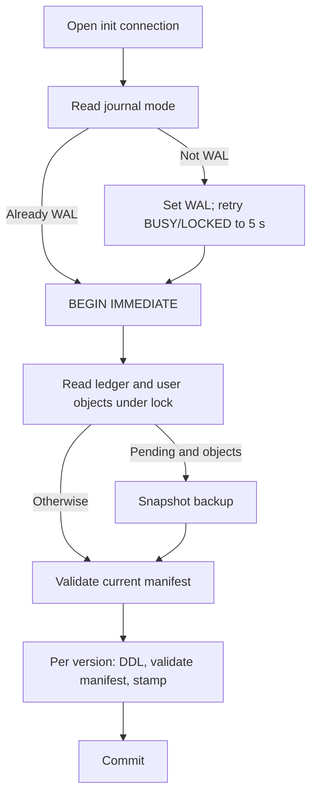

# T-004 Independent QA Evidence — Cycle 4

## Outcome

**Overall verdict: PASS.** The canonical verifier exits 0 with 209 collected and passed tests, and all four acceptance criteria were confirmed independently. The two cycle-3 races no longer reproduce: an exact legacy database injected immediately before the initialization connection opens receives one readable backup, and simulated `SQLITE_BUSY`/`SQLITE_LOCKED` on `PRAGMA journal_mode = WAL` is retried to completion. Thirteen pytest executions of the Windows-spawn migration test and seven eight-process stress rounds completed with every exit code 0. The version-specific manifest rejects every attempted bypass QA constructed, including the cycle-3 critic's `CREATE TABLE IF NOT EXISTS` finding.

QA's PASS is one gate. The task still requires adversarial-critic `CLEAR` and the named human clearance for the `ESCALATE` marker before the primary agent marks T-004 `DONE`. `qa.md` and `qa-cycle-3.md` remain unchanged; this file records only the owner-authorized fourth cycle.

## Acceptance Verdicts

| Criterion | Verdict | Evidence |
| --- | --- | --- |
| AC1: operation-owned connections and pragmas | PASS | `test_operations_use_fresh_configured_connections` observed seven distinct thread-affine connections, each with foreign keys `1`, busy timeout `5000`, and journal mode `wal`; one WAL assignment, six or more verifications. |
| AC2: forward-only transactional versions | PASS | Exact legacy and current-v1 paths stamped `[(1,)]`; a correct v2 plan stamped `[(1,), (2,)]`; every drifted, missing, extra, or noncanonical object was rejected before its ledger row, with the live schema unchanged. |
| AC3: pre-migration backup | PASS | Diagnostic A injected the legacy database after the former precheck point and found exactly one readable `*.backup-*.sqlite3` containing both fake rows and no ledger table. Eight-process stress rounds each retained exactly one backup. |
| AC4: concurrency and rollback | PASS | Thirteen pytest executions of the spawn test and seven stress rounds (56 constructors) completed with exit codes all `0`; injected v1 and v2 migration failures rolled back and preserved the copied backup. |

## Verified Control Path

Diagnostics A and B exercised the two left-hand branches; diagnostics C, D, and F exercised G and H; the spawn repetitions and diagnostic E exercised the whole path across processes.

## Verification Record

### Core Gates

All pytest runs used distinct `--basetemp` paths under `.test-tmp\` with `-p no:cacheprovider -o addopts=`. Interpreter: `.venv-py312\Scripts\python.exe`, Python 3.12.10, SQLite 3.49.1.

| Gate | Exact command | Result |
| --- | --- | --- |
| State target | `.\.venv-py312\Scripts\python.exe -m pytest -q -p no:cacheprovider -o addopts= --basetemp=.test-tmp\qa4-state-7f21 tests\test_state_store.py` | Exit `0`; 43 passed in 1.81 s |
| Concurrency 1–3 | Same options with `--basetemp=.test-tmp\qa4-conc-{1,2,3}-9c3e tests\test_state_store_concurrency.py`, consecutive | Exit `0`, `0`, `0`; 6 passed in 3.37 s, 3.63 s, 2.54 s |
| Relevant regression | Same options with `--basetemp=.test-tmp\qa4-regress-d41a` and state, concurrency, `tests\test_ebay_auth.py`, `tests\test_orchestrator.py` | Exit `0`; 81 passed in 5.55 s |
| Spawn repeats 1–8 | Same options with `--basetemp=.test-tmp\qa4-spawn-{1..8}-e2b7 tests\test_state_store_concurrency.py::test_spawned_processes_serialize_one_legacy_migration_and_backup` | Exit `0` eight times; 1 passed each, 0.79 s to 1.59 s |
| Canonical verification | `powershell.exe -NoProfile -ExecutionPolicy Bypass -File scripts\verify.ps1` | Exit `0`; Python 3.12.10; `pip check` clean; 209 collected and passed |
| Process stress (diagnostic E) | Scratchpad script: eight spawn processes per round on one legacy database, five rounds, plus two rounds on a nonexistent path | Exit `0`; every round exit codes `[0]*8`, ledger `[(1,)]`, WAL, one backup per legacy round, none per fresh round, no partial |
| Patch and status hygiene | `git diff --check; git status --short; git ls-files --others --exclude-standard; git ls-files --others --ignored --exclude-standard` | Exit `0`; line-ending warnings only; `.test-tmp/` ignored; no database, WAL, cache, or build artifact outside `.test-tmp/` |

Counting the three concurrency runs, the regression, the verifier, and the eight dedicated repetitions, the spawn test executed thirteen times with no failure.

### Cycle-3 Race Reproductions

Both diagnostics ran as standard-input Python against the product module with disposable `tempfile` directories and fake rows.

| Diagnostic | Method | Result |
| --- | --- | --- |
| A: backup eligibility gap | Monkeypatched `StateStore._open_connection`; created the exact legacy database (tables `items`, `token_cache`, one fake row each) on the first `enable_wal=True` call, then delegated to the real method | Injected at open 1; ledger `[[1]]`; both rows readable through the store; journal mode `wal`; backup count `1`; partials `0`; backup holds one item, one token, no ledger table. `QA4_A_BACKUP_GAP_CLOSED` |
| B1: BUSY with error code | `sqlite3.Connection` subclass factory raising `OperationalError("database is locked")` with `sqlite_errorcode = SQLITE_BUSY` on the first four WAL assignments | Constructed; five WAL attempts; sleeps `[0.005, 0.01, 0.02, 0.04]`; final mode `wal` |
| B2: LOCKED with error code | Same factory, `SQLITE_LOCKED` once | Constructed; two attempts; one 5 ms sleep; final mode `wal` |
| B3: message-only contention | Same factory, no `sqlite_errorcode` attribute, three failures | Constructed; four attempts; three ascending sleeps; final mode `wal` |
| B4: non-contention error | Same factory raising `OperationalError("unable to open database file")` once | `StateStoreMigrationError` with that cause; one attempt; zero sleeps; not retried. `QA4_B_WAL_RETRY_OK` |

### Schema-Adversarial Matrix

Each case compared user objects, ledger, item, and token rows before and after the constructor attempt. "Unchanged" means that comparison was equal.

#### Required Manifest Attacks

| Case | Input | Result |
| --- | --- | --- |
| C1 | Valid v1 plus precreated malformed `migration_probe`; monkeypatched v2 uses `CREATE TABLE IF NOT EXISTS` | Rejected as unexpected v1 object; ledger `[(1,)]`; malformed row intact; one backup |
| C1b | Valid v1; v2 migration itself creates a drifted `migration_probe`, then `IF NOT EXISTS` the canonical form | Rejected at the v2 manifest stage; rolled back; ledger `[(1,)]`; probe table absent; one backup |
| C2 | v2 migration declared with no v2 manifest | Rejected with "same version sequence"; no database file or sibling created |
| C3 | Valid v1 with a stray table | Rejected as unexpected object; unchanged; no backup because nothing was pending |
| C4 | Correct v2 migration with matching manifest on a v1 database holding one item | Constructed; ledger `[(1,), (2,)]`; exactly one backup holding ledger `[(1,)]`, no probe table, the item row |
| C4 reopen | Same database reopened under the v2 plan, then under the shipped v1-only plan | v2 plan: constructed, still one backup; v1 plan: rejected as newer than the application |

#### QA-Chosen Attacks

| Case | Input | Result |
| --- | --- | --- |
| D1 | Valid v1 plus an unexpected view, trigger, or index (three databases) | Each rejected as unexpected object; unchanged; no backup |
| D2 | Legacy `token_cache` with trailing `STRICT`, `WITHOUT ROWID`, or paren-adjacent whitespace change; `items` exactly canonical | All rejected; `STRICT` and whitespace fail on canonical SQL with identical PRAGMA metadata; `WITHOUT ROWID` fails on PRAGMA (`notnull` becomes 1); rows preserved; one backup each; no ledger |
| D3 | Legacy tables plus an empty canonical ledger; separately, a forged ledger row `(1,)` on a ledger without its CHECK | Empty ledger rejected as unexpected version ledger with one backup; forged ledger rejected on canonical SQL, unchanged, no backup |
| D4 | Legacy `items` with a block comment in its CREATE SQL and identical PRAGMA metadata | Rejected on canonical SQL; rows preserved; one backup |
| D5 | Legacy table named `Items` | Rejected as missing `items`; unchanged; one backup |
| D6–D8 | v2 DDL with an extra column; v2 no-op with a manifest requiring a table; v2 CREATE SQL containing a comment | All rejected at the v2 stage; ledger `[(1,)]`; unchanged; one backup where a migration was pending |
| D9–D12 | Incomplete manifest entry; `sqlite_`-prefixed evasion; `ANALYZE` statistics; stale `.partial` neighbor | Plan rejected before file creation; SQLite refuses reserved names; `sqlite_stat1` tolerated and constructor succeeds; stale partial untouched and one complete backup written |

#### Legacy Compatibility

Diagnostic F extracted both `CREATE TABLE IF NOT EXISTS` statements from `git show a7bb498:src/core/state_store.py`, built a database with them plus fake rows, and confirmed each stored form canonicalizes to the frozen manifest, PRAGMA metadata matches, the store migrates it to `[(1,)]`, reads the row, and retains one backup. Real databases written by the pre-T-004 code therefore satisfy the version-0 manifest.

## Backup and Rollback Checks

| Scenario | Exact command or observation | Result |
| --- | --- | --- |
| Normal legacy backup | State target and diagnostics A, E, F | One readable backup; fake rows preserved; current-v1 reopen created none |
| Injected v1 migration failure | `test_failed_migration_rolls_back_and_preserves_readable_backup` in the state target | Live schema rolled back; backup readable |
| Injected v2 failure | Diagnostics C1b, D6, D7, D8 | Rolled back to `[(1,)]`; no partial objects; backup retained |
| Spawned migration | Thirteen pytest executions and seven stress rounds | Exactly one backup per legacy database, none for fresh paths, no `.partial` |
| Repeated rejected attempts (diagnostic G) | Three constructor attempts against a `STRICT` legacy `token_cache` | `[("rejected", 1), ("rejected", 2), ("rejected", 3)]` — one new backup per attempt |

## Cycle History

| Cycle | Evidence-based disposition |
| --- | --- |
| 1 | Rejected for schema drift, keeper lifecycle, backup lock point, WAL verification, and process coverage gaps. |
| 2 | Rejected because comment-only constraint text passed substring validation; preserved in `qa.md`. |
| 3 | Canonical SQL and enforcement probes passed; backup-eligibility and WAL-initialization races kept the verdict at FAIL. |
| 4 | Lock-held backup eligibility, retry-safe WAL activation, and per-version manifests confirmed independently; PASS pending critic and human gates. |

## Unresolved Findings

None blocks an acceptance criterion. The following are recorded for the critic and primary agent.

- Backup accumulation: because the snapshot precedes legacy validation, every failed launch against an unmigratable legacy database writes one more backup (diagnostic G). Operators retrying a rejected database will see the sibling files grow until the schema is repaired.
- Whitespace sensitivity: canonicalization folds whitespace runs but does not normalize whitespace adjacent to punctuation, so `(id` and `( id` differ. This is fail-closed and diagnostic F shows the real legacy DDL matches, but it extends the builder's stated "semantically equivalent schemas are rejected" boundary to a spacing difference.
- Unretried mode reads: the initial `PRAGMA journal_mode` read in `_activate_wal` and the per-operation mode verification rely on `busy_timeout` alone. No failure was observed in 13 pytest executions or 56 stress constructors; the risk is residual, not reproduced.
- Failed non-contention WAL activation leaves a header-only file with journal mode `delete`; the next constructor treats it as an empty database. Benign, but it is not cleaned up.

## Boundaries and Limitations

- QA used branch `tier3-v2-roadmap` at HEAD `a7bb498fdcfe4e409065ab2764acca2a109344e3` plus the uncommitted T-004 diff. Other uncommitted files in the working tree (`.team/DECISIONS.md`, `README.md`, `docs/FMEA.md`, `working/*`, `docs/proposals/*`) were not reviewed by this QA pass.
- No real database, `%APPDATA%/ListerBridge`, `.env`, credential file, network service, GUI, or publication path was accessed. All fixtures used fake rows and disposable `tempfile` or `.test-tmp\` directories; QA scratch scripts lived outside the repository.
- Two QA harness defects (a non-raw `ESCAPE` string and a fixture whose `items` DDL lacked the canonical paren-adjacent space) were corrected and rerun; no product file was changed.
- Any index, view, or trigger on the state tables fails closed by design; performance indexes require a manifest entry in a future version.
- Local tests do not establish packaged-GUI persistence or live external-service behavior.

## HFE Review

- [x] Chunking: no list or table exceeds seven ungrouped items; the diagram has nine nodes.
- [x] Signal-to-noise: each section supports a verdict, reproduction, boundary, or residual finding.
- [x] Signaling: bold is reserved for the overall decision status.
- [x] Contiguity: commands, outputs, and interpretations are adjacent.
- [x] Redundancy: the diagram shows the control path; prose supplies which diagnostic exercised each branch.
- [x] Dual-channel: the verified mechanism has a compact Mermaid visual.
- [x] Progressive disclosure: verdicts precede mechanism, verification, attacks, and limitations.

This changes if any later run of the spawn test or the stress script fails with a lock error, if a schema that bypasses a manifest is found, if an artifact inspected here is modified after this inspection, or if the adversarial critic or the escalation owner rejects the task.
