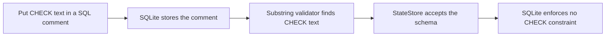

# T-004 Independent QA Evidence

## Outcome

**Overall verdict: FAIL.** AC2 fails because the current exact-schema validator accepts required `CHECK` text inside SQL comments even though SQLite does not enforce comments as constraints. The prescribed suites all pass, but those results are non-dispositive because the adversarial copied-database fixture bypasses the fail-closed guarantee.

T-004 must not move to `DONE`. This is the second rejected build-to-QA cycle and therefore requires escalation under `.team/TEAM_PROTOCOL.md` before another remediation cycle.

## Acceptance Verdicts

| Criterion | Verdict | Evidence |
| --- | --- | --- |
| AC1: operation-owned connections and pragmas | PASS | Distinct normally thread-affine operation connections closed cleanly; file operations observed WAL, foreign keys `1`, and busy timeout `5000`; only the memory keeper disabled thread affinity. |
| AC2: forward-only transactional versions | FAIL | Valid, empty, newer, gapped, malformed, and mismatch tests passed, but comment-only `CHECK` text was accepted as an enforced constraint. |
| AC3: one pre-migration backup | PASS | Legacy and Windows-spawn fixtures retained one readable backup with fake rows; new/current databases retained none. |
| AC4: rollback and concurrency | PASS | Injected migration failure rolled back; mixed writes, same-SKU upserts, cross-thread close, 12-way close, constructors, and spawned migrators completed. |

## Blocking Evidence

The validator normalizes `sqlite_master.sql` and searches for the strings `check(version>=1)` and `check(id=1)`. It does not remove SQL comments or compare canonical `CREATE TABLE` definitions.



### Exact Reproduction

The disposable fixture used exact v1 column metadata but replaced both required constraints with comments:

```sql
CREATE TABLE schema_migrations (
    version INTEGER PRIMARY KEY /* CHECK (version >= 1) */,
    applied_at TEXT NOT NULL
);

CREATE TABLE token_cache (
    id INTEGER PRIMARY KEY /* CHECK (id = 1) */,
    access_token TEXT NOT NULL,
    expires_at_epoch REAL NOT NULL,
    scopes TEXT NOT NULL DEFAULT ''
);
```

The fixture included the exact seven-column `items` table and version row `1`, then constructed and closed `StateStore` against the copied repository-local database. It was executed through:

```powershell
$code | & .\.venv-py312\Scripts\python.exe -
```

Result:

```text
ACCEPTED_COMMENT_ONLY_CHECKS
Exit code: 0
```

SQLite treats `/* CHECK (...) */` as a comment, not a table constraint. Acceptance therefore proves only that the required text appeared in stored SQL, not that the database enforced `version >= 1` or `id = 1`.

## Schema Matrix

### Items Table

| Column | Type | Not null | Default | PK | Valid-path result |
| --- | --- | ---: | --- | ---: | --- |
| `item_sku` | `TEXT` | 0 | none | 1 | match |
| `batch_folder_id` | `TEXT` | 1 | none | 0 | match |
| `status` | `TEXT` | 1 | none | 0 | match |
| `offer_id` | `TEXT` | 0 | none | 0 | match |
| `listing_id` | `TEXT` | 0 | none | 0 | match |
| `eps_urls` | `TEXT` | 1 | `'[]'` | 0 | match |
| `updated_at` | `TEXT` | 1 | none | 0 | match |

### Token Cache Table

| Column | Type | Not null | Default | PK | Valid-path result |
| --- | --- | ---: | --- | ---: | --- |
| `id` | `INTEGER` | 0 | none | 1 | metadata match; CHECK spoof accepted |
| `access_token` | `TEXT` | 1 | none | 0 | match |
| `expires_at_epoch` | `REAL` | 1 | none | 0 | match |
| `scopes` | `TEXT` | 1 | `''` | 0 | match |

### Version Ledger

| Column | Type | Not null | Default | PK | Valid-path result |
| --- | --- | ---: | --- | ---: | --- |
| `version` | `INTEGER` | 0 | none | 1 | metadata match; CHECK spoof accepted |
| `applied_at` | `TEXT` | 1 | none | 0 | match |

The valid migration path creates genuine constraints. The failure is that a drifted current schema containing comment text is also accepted.

## Completed Verification

### Commands and Results

| Gate | Exact command | Exit | Result |
| --- | --- | ---: | --- |
| Exact state | `.\.venv-py312\Scripts\python.exe -m pytest -o addopts='' -q -p no:cacheprovider --basetemp .test-tmp\t004-qa2-state-20260715 tests\test_state_store.py` | 0 | 19 passed in 0.50 s |
| Concurrency 1 | `.\.venv-py312\Scripts\python.exe -m pytest -o addopts='' -q -p no:cacheprovider --basetemp .test-tmp\t004-qa2-concurrency-20260715-1 tests\test_state_store_concurrency.py` | 0 | 6 passed in 1.52 s |
| Concurrency 2 | Same command with basetemp suffix `-2` | 0 | 6 passed in 1.39 s |
| Concurrency 3 | Same command with basetemp suffix `-3` | 0 | 6 passed in 1.57 s |
| Relevant regression | `.\.venv-py312\Scripts\python.exe -m pytest -o addopts='' -q -p no:cacheprovider --basetemp .test-tmp\t004-qa2-regression-20260715 tests\test_state_store.py tests\test_state_store_concurrency.py tests\test_ebay_auth.py tests\test_orchestrator.py` | 0 | 57 passed in 2.09 s |
| Canonical VERIFY | `powershell.exe -NoProfile -ExecutionPolicy Bypass -File scripts\verify.ps1` | 0 | Python 3.12.10; `pip check` clean; 185 collected and passed |
| Adversarial CHECK spoof | PowerShell standard-input fixture above | 0 | Logical failure: `ACCEPTED_COMMENT_ONLY_CHECKS` |

Passing tests do not offset the blocking reproduction: AC2 requires rejection of every schema that lacks the frozen constraints.

### Backup and Rollback Observations

| Scenario | Live database | Retained backup | Partial file |
| --- | --- | --- | --- |
| Successful legacy migration | 1 fake item; 1 fake token; ledger `[1]` | Exactly 1; 1 item and 1 token; no ledger | none |
| Injected migration failure | 1 fake item; 1 fake token; no ledger or probe table | Exactly 1; 1 item and 1 token | no incomplete final backup observed |
| New and current database | Current v1 schema | none | none |
| Four spawned migrators | 1 fake item; 1 fake token; ledger `[1]` | Exactly 1; readable; no ledger | none |

### Concurrency Repeats

| Run | Windows-spawn workers | Bound | Result |
| --- | ---: | --- | --- |
| 1 | 4 | 30 seconds | 6 tests passed; all workers exited `0` |
| 2 | 4 | 30 seconds | 6 tests passed; all workers exited `0` |
| 3 | 4 | 30 seconds | 6 tests passed; all workers exited `0` |

Across the three consecutive runs, 12 spawned legacy migrators completed through four-process groups. Each run asserted one ledger row, one readable backup, preserved fake rows, and no partial backup.

## Audit and Boundaries

### Two-Cycle History

| Cycle | Outcome | Disposition |
| --- | --- | --- |
| Initial cycle | Rejected for schema-drift acceptance, keeper lifecycle, backup lock point, WAL verification, and empty-plan gaps | Builder remediated before renewed QA. |
| Renewed cycle | Prescribed suites passed; adversarial comment-only constraints were accepted | Overall FAIL; escalation required before further remediation. |

### Scope and Hygiene

- Tests used only copied, repository-local temporary SQLite databases and fake tokens.
- No real database, `.env`, credential file, `%APPDATA%/ListerBridge`, network API, or GUI was accessed.
- `git diff --check` exited `0`; only line-ending warnings appeared.
- `git status --short` showed no visible test cache, build directory, or generated database path.
- Source search found no `PUBLISHING`, publication checkpoint, publication claim, or `claim_` implementation; that scope remains T-005.

## Bounded Remedy

1. Strip SQL comments and compare each accepted table against a canonical normalized `CREATE TABLE` definition, including the complete constraint set.
2. Add negative fixtures for block-comment and line-comment CHECK text, string-literal spoofing, missing constraints, and extra constraints.
3. Add behavioral probes inside a rolled-back savepoint when canonical SQL comparison cannot establish constraint enforcement.
4. Re-run exact state, three concurrency repetitions, relevant regression, canonical VERIFY, and this adversarial fixture only after escalation authorizes another cycle.

## Limitations

- QA verified local Windows and SQLite behavior only; it did not exercise a packaged executable or live service.
- Three repeated process runs probe reliability but do not prove absence of every scheduling race.
- Exact-schema validation remains unacceptable until the comment-only fixture fails closed.

## HFE Review

- [x] Chunking: tables, lists, and diagram regions stay within seven items.
- [x] Signal-to-noise: each section supports the verdict or reproduction.
- [x] Signaling: bold is reserved for the overall decision status.
- [x] Contiguity: each result is adjacent to its command or criterion.
- [x] Redundancy: the diagram explains the mechanism; prose explains its consequence.
- [x] Dual-channel: the multi-step failure mechanism has a Mermaid flowchart.
- [x] Progressive disclosure: verdict precedes detailed evidence and remedy.

This changes if a renewed, authorized implementation rejects comment-only and string-only CHECK text while preserving the valid legacy migration and concurrency results.
