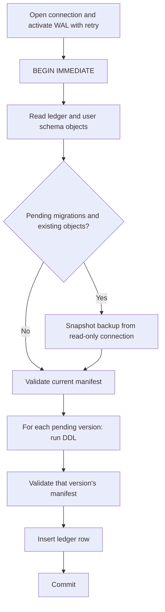
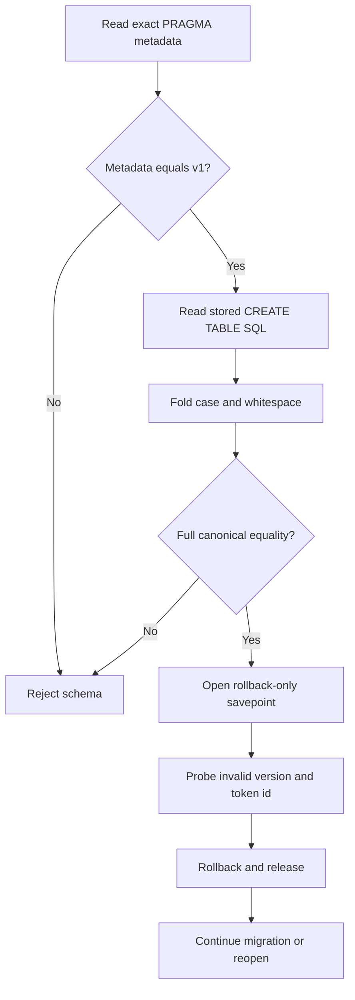

# T-004 Builder Handoff

## Outcome

The owner-authorized fourth remediation cycle (2026-09-10) is implemented and builder-verified. It closes the three cycle-3 exit conditions: backup eligibility is now decided from schema state read under `BEGIN IMMEDIATE`, WAL activation retries through transient `SQLITE_BUSY`/`SQLITE_LOCKED`, and every schema version validates against its own complete manifest before it is stamped. Cycle 3's canonical-SQL and probe controls are unchanged.

T-004 remains awaiting independent QA and adversarial review. The builder cannot mark it `DONE`. Publication claims and `PUBLISHING` state remain excluded for T-005.

## Cycle History

| Cycle | Evidence-based disposition |
| --- | --- |
| 1 | Rejected; schema drift, keeper lifecycle, backup lock point, WAL verification, and process coverage were remediated. |
| 2 | Rejected; required `CHECK` text inside comments could satisfy substring validation. |
| 3 | Authorized by the user; full canonical SQL comparison and behavioral enforcement probes replace substring validation. Rejected on pre-lock backup sampling and WAL contention. |
| 4 | Authorized by the owner; lock-held backup eligibility, retry-safe WAL activation, and per-version schema manifests. Awaiting independent QA. |

## Cycle-Four Remedy

| Cycle-3 finding | Cycle-4 control |
| --- | --- |
| AC3: backup flag sampled from file size before the lock | `_user_schema_objects()` runs after `BEGIN IMMEDIATE`; a backup is taken whenever pending migrations meet any existing user object. The file-size precheck is gone. |
| AC4: `PRAGMA journal_mode = WAL` died on `database is locked` | `_activate_wal()` reads the mode first, skips assignment when already WAL, and otherwise retries BUSY/LOCKED with 5 ms to 100 ms backoff until the 5000 ms deadline, then verifies the reported mode. Non-contention errors fail immediately. |
| Critic: validation hard-coded to v1 tables | `_SCHEMA_MANIFESTS` holds one complete manifest per version (0 legacy, 1 current). The plan is rejected unless migration versions and manifest versions match exactly. Each version validates against its own manifest before its ledger row is written, and any user object outside the manifest is rejected as drift. |

## Cycle-Four Verification

| Gate | Reproduction | Result |
| --- | --- | --- |
| Exact state target | `.venv-py312\Scripts\python.exe -m pytest -q -p no:cacheprovider -o addopts= --basetemp=.test-tmp\c4-b tests\test_state_store.py` | 43 passed (32 prior plus 11 cycle-4 tests) |
| Concurrency reliability | Same options, `tests\test_state_store_concurrency.py`, three consecutive fresh basetemps | 6 passed in each of 3 runs |
| Deterministic races | `test_legacy_database_appearing_before_lock_still_gets_backup`, `test_wal_activation_retries_through_transient_lock_contention` | Both pass; one backup retained, three WAL attempts with two sleeps |
| Manifest guards | `test_future_migration_cannot_stamp_preexisting_malformed_table`, `test_migration_plan_without_matching_manifest_is_rejected`, `test_unexpected_extra_table_in_current_database_is_rejected` | All pass; version stays 1 and rows are untouched |
| Spawn stress | Ten sequential runs of the spawned-legacy-migration and 12-thread initialization tests, each with a fresh basetemp | 10 of 10 runs passed; zero lock errors |
| Canonical verification | `powershell.exe -NoProfile -ExecutionPolicy Bypass -File scripts\verify.ps1` | Exit 0; Python 3.12.10; `pip check` clean; 209 collected and passed |
| Patch hygiene | `git diff --check` | Exit 0; line-ending warnings only |

The verification interpreter moved from `%TEMP%` to `%LOCALAPPDATA%\Programs\Python\Python312` on 2026-09-10 after Temp cleanup destroyed the cycle-3 interpreter (`.team/LESSONS.md`).

## Cycle-Four Risk Boundaries

- A database with any user object outside its manifest now fails closed, including one that a future task adds without a manifest entry. That is intentional: manifests must grow with migrations.
- The WAL retry sleeps in the constructor for at most the busy-timeout window; it never spins without a deadline.
- The `_validate_constraint_behavior` public signature is unchanged; probes moved into `_CHECK_PROBES` so a future version can declare its own.
- Test files changed only to supply version-2 manifests where they already patched a version-2 migration, and to add the cycle-4 cases.

## Cycle-Three Remedy

| Control | Implementation |
| --- | --- |
| Canonical source | SQLite diagnostics confirmed that legacy and migration-one definitions converge on one unquoted stored form per table after `IF NOT EXISTS` and semicolon removal. |
| Conservative normalization | Comparison folds case and whitespace only; comments, quotes, string delimiters, punctuation, and extra clauses remain. |
| Full equality | Each complete stored `CREATE TABLE` statement must equal its deliberately enumerated canonical form. |
| Behavioral proof | Version `0` and token row id `2` must fail with `SQLITE_CONSTRAINT_CHECK`. |
| Rollback guarantee | Both probes run inside one savepoint with unconditional `ROLLBACK TO` and `RELEASE`. |

The adversarial target covers block comments, line comments, string-literal always-true checks, missing constraints, and extra constraints. Exact PRAGMA column metadata validation remains unchanged and runs before SQL comparison.

## Architecture

## Changed Files

- `src/core/state_store.py` implements canonical SQL equality and rollback-only constraint probes (cycle 3), plus lock-held backup eligibility, `_activate_wal` retry, and `_SCHEMA_MANIFESTS` (cycle 4).
- `tests/test_state_store.py` adds ten spoof fixtures, two enforcement-probe cases, and a current-schema no-mutation case (cycle 3), plus eleven cycle-4 cases covering the backup race, WAL retry, and manifests.
- `tests/test_state_store_concurrency.py` is unchanged in cycles three and four and was re-run three times per cycle.
- `.team/handoffs/T-004.md` records scope, results, and the remaining independent gate.

## Builder Verification

| Gate | Reproduction | Result |
| --- | --- | --- |
| Exact state target | `pytest tests/test_state_store.py` with cache disabled | 32 passed |
| Concurrency reliability | `pytest tests/test_state_store_concurrency.py` with cache disabled | 6 passed in each of 3 runs |
| Call-site regression | State, concurrency, eBay auth, and orchestrator targets | 70 passed |
| Canonical verification | `powershell.exe -NoProfile -ExecutionPolicy Bypass -File scripts\verify.ps1` | Python 3.12.10; 198 collected and passed |
| Dependency integrity | Canonical verifier `pip check` stage | No broken requirements |
| Patch hygiene | `git diff --check` | Exit 0; line-ending warnings only |

## Risk Boundaries

- Canonical forms intentionally reject semantically equivalent but undocumented quoted or reordered schemas.
- Future migrations must add version-specific canonical definitions instead of weakening version one.
- Retained backups may contain cached tokens; product code does not log backup contents.
- Tests use temporary databases and fake tokens only.
- Process-local locks and SQLite write locks cover local migration serialization, not remote publication.
- No T-005 publication claim, checkpoint, reconciliation, or remote-call behavior was introduced.

## Independent Gate

1. Reproduce every spoof fixture outside the builder tests.
2. Verify no version `0` or token id `2` survives validation.
3. Repeat the Windows-spawn migration and single-backup proof.
4. Run the relevant regressions and canonical verifier from a fresh temp root.
5. Obtain adversarial critic `CLEAR` before the primary changes task status.

## HFE Review

- [x] Chunking: tables and lists stay within seven items; the diagram has ten nodes.
- [x] Signal-to-noise: each section supports implementation review or reproduction.
- [x] Signaling: headings and labels expose task state without decorative emphasis.
- [x] Contiguity: findings, controls, commands, and results stay adjacent.
- [x] Redundancy: prose explains rationale while the diagram shows sequence.
- [x] Dual-channel: the enforcement path includes a compact Mermaid flowchart.
- [x] Progressive disclosure: outcome precedes mechanism, evidence, and residual risk.

No commit, push, credential access, AppData access, real database access, or publication-state expansion occurred.

This changes if independent QA reproduces a canonical-schema bypass, persistent probe row, concurrency regression, unreadable backup, or lifecycle race.
