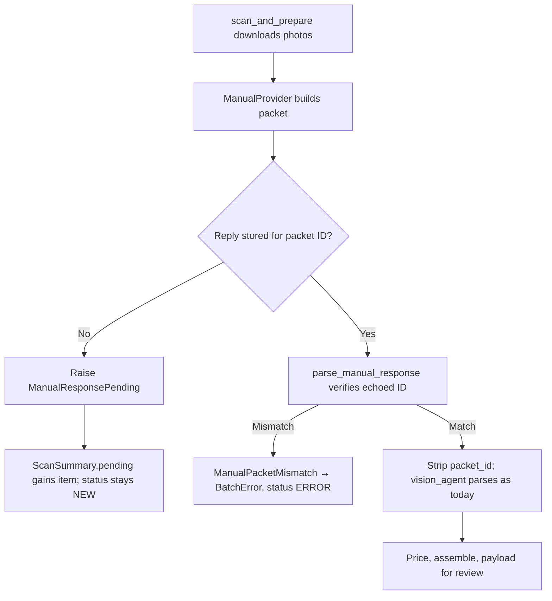

# T-026 Builder Handoff

## Outcome

The manual paste AI provider core is implemented and builder-verified. An operator can run Vision extraction through any subscription chat: Lister-Bridge renders a deterministic packet per item, the operator pastes it with the photos, and the pasted JSON reply is verified against the packet ID before the unchanged `vision_agent` parser runs. No Gemini API key is needed on this route.

T-026 stops at `READY-FOR-QA`. The review UI (packet display, paste box, Help section) is T-027 (#11). Publication, pricing, state schema, and the frozen contracts are unchanged.

## Design Summary

| Control | Implementation |
| --- | --- |
| Deterministic packet | `build_packet()` sorts photos by file name and derives a UUID-shaped ID from a SHA-256 over adapter code, adapter version, prompt text, and photo names. Equal inputs give byte-identical packets; a moved cache directory does not change the ID. |
| Reply verification (PI-014) | `parse_manual_response()` requires an echoed `packet_id` equal to the packet's ID (case-insensitive), treats the model's `MISMATCH` answer as a rejection, then strips the key so `VisionAgentOutput` (`extra="forbid"`) parses unchanged. |
| Provider contract | `ManualProvider(AIProvider)` returns the verified reply for a packet or raises `ManualResponsePending(packet)`. `store_response()` validates before storing, so a bad paste is never applied later. |
| Orchestrator pending path | `scan_and_prepare` catches `ManualResponsePending` before the generic handler, appends a `PendingManualItem` to `ScanSummary.pending`, and leaves the item at `NEW` (not `ERROR`) so a rescan retries once a reply exists. |
| Settings switch | `AI_PROVIDER=gemini|manual` in the Gemini settings group and `.env.example`. `ai_provider_mode()` normalizes the value; unknown values mean Gemini. `missing_required()` drops `GEMINI_API_KEY` only in manual mode. |

## Changed Files

- `src/ai/manual_provider.py` (new): `ManualPacket`, `build_packet`, `parse_manual_response`, `ManualProvider`, `ManualResponsePending`, `ManualPacketMismatch`.
- `src/core/orchestrator.py`: `PendingManualItem`, `ScanSummary.pending`, the pending branch in `scan_and_prepare`; docstrings extended, none removed.
- `src/core/settings.py`: `AI_PROVIDER` field, `ai_provider_mode`, manual-mode exemption in `missing_required`.
- `.env.example`: `AI_PROVIDER=gemini` with guidance.
- `tests/test_manual_provider.py` (new): 24 tests across packets, parsing, provider, orchestrator, settings, and import purity.

## Builder Verification

| Gate | Reproduction | Result |
| --- | --- | --- |
| Manual provider and neighbors | `.venv-py312\Scripts\python.exe -m pytest -q -p no:cacheprovider -o addopts= --basetemp=.test-tmp\t26-a tests\test_manual_provider.py tests\test_orchestrator.py tests\test_settings.py tests\test_vision_agent.py tests\test_help_content.py tests\test_integration.py` | 103 passed |
| Canonical verification | `powershell.exe -NoProfile -ExecutionPolicy Bypass -File scripts\verify.ps1` | Exit 0; Python 3.12.10; 233 collected and passed |
| Patch hygiene | `git diff --check`; `git status --short` | Exit 0; only the five task files plus PLAN and STATE changed |

## Acceptance Criteria Mapping

| AC | Evidence |
| --- | --- |
| AC1 deterministic packet | `test_build_packet_is_deterministic_and_order_insensitive`, `test_build_packet_id_changes_with_photo_set_prompt_and_adapter_version` |
| AC2 provider contract and PI-004/PI-005 reuse | `test_provider_raises_pending_with_packet_when_no_reply_stored`, `test_provider_store_then_generate_feeds_extract_item` |
| AC3 mismatch rejected before parsing | `test_parse_rejects_missing_packet_id`, `test_parse_rejects_reply_for_another_item`, `test_provider_store_response_validates_and_never_stores_bad_reply` |
| AC4 pending path and rescan | `test_scan_reports_pending_items_and_leaves_status_new`, `test_rescan_completes_items_after_replies_are_stored`, `test_injected_wrong_item_reply_is_an_error_not_a_payload` |
| AC5 settings switch and import purity | `test_manual_mode_drops_gemini_key_from_missing_required`, `test_ai_provider_mode_normalizes_values`, `test_manual_provider_module_imports_no_streamlit_or_gemini_sdk` |

## Risk Boundaries

- Stored replies live in whatever mapping the caller injects (the UI will pass Streamlit session state). Persisting them across restarts is T-006 `ReviewCandidate` scope.
- The headless entry point (`orchestrator.main`) still constructs `GeminiProvider`; a manual route has no operator to paste in headless mode, so this is intentional and unchanged.
- The packet lists file names only; the UI (T-027) must show the folder so the operator can find and attach the photos.
- Photos leave the machine under the operator's chat subscription terms, as they do under the Gemini API today; T-027's Help text states this.
- No clipboard or browser automation exists or is planned.

## Independent Gate

1. Reproduce the packet determinism and cross-item mismatch rejection outside the builder tests.
2. Attempt to smuggle a reply past verification (wrong ID, missing ID, whitespace or case variants, fenced and prose-wrapped replies, extra keys).
3. Confirm the orchestrator never marks a pending item `ERROR` and never yields a payload from a mismatched reply.
4. Confirm `AI_PROVIDER` unknown values keep the Gemini key requirement.
5. Run the canonical verifier from a fresh temp root; obtain adversarial critic clearance before the primary changes task status.

## HFE Review

- [x] Chunking: no list or table exceeds seven items; the diagram has nine nodes.
- [x] Signal-to-noise: each section supports review, reproduction, or scope.
- [x] Signaling: bold is not used; status words appear in headings and tables.
- [x] Contiguity: each control sits beside its implementation; each AC beside its tests.
- [x] Redundancy: the diagram carries the flow; prose carries rationale and boundaries.
- [x] Dual-channel: the pending/verify sequence has a flowchart.
- [x] Progressive disclosure: outcome precedes design, files, verification, and risk.

No commit, push, credential access, AppData access, network call, or contract change occurred.

This changes if independent QA finds a reply that passes verification without the exact packet ID, a pending item recorded as an error, or a manual-mode configuration that still demands a Gemini key.
