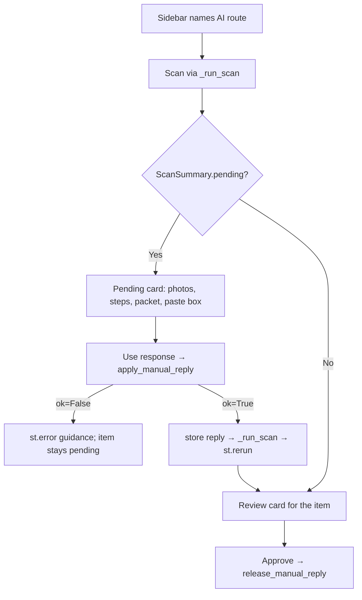

# T-027 Builder Handoff

## Outcome

The manual paste workflow is rendered in the Streamlit review UI and builder-verified, including a live browser rehearsal against fake Drive batches. The Scan button now builds the provider selected by `AI_PROVIDER`, the sidebar names the active route, each waiting item shows a pending card with photos, folder, steps, the copyable packet, and a paste box, and every rejected paste produces plain guidance while the item stays pending. The Help tab gains a "Manual AI mode" section.

T-027 stops at `READY-FOR-QA`. AC5 (the owner's smoke test) is the owner's action and follows `.team/evidence/T-027/smoke-guide.md`; this is the first operator test point under D-TEAM-009.

## Design Summary

| Control | Implementation |
| --- | --- |
| Route selection (AC1) | `review.build_provider(values, manual_replies)` returns `ManualProvider` or `GeminiProvider` from `settings.ai_provider_mode`; `app._get_provider()` calls it with a dedicated `st.session_state["manual_replies"]` dict. The sidebar shows `review.provider_mode_label` and a manual-mode note. |
| Pending card (AC2) | `review.pending_item_view` flattens `PendingManualItem` into SKU, folder, packet ID, prompt, sorted photo paths and names, photo folder, and checklist. `app._render_pending_item` draws photos, steps, `st.code` (copy control), the packet ID, a paste box, and "Use response", which stores the reply and calls `_run_scan` then `st.rerun`. |
| Guidance (AC3) | `review.apply_manual_reply` returns `ManualReplyResult(ok, message)`: empty paste, `MISMATCH` (including `**MISMATCH**` and `MISMATCH.` via `normalize_manual_reply`), wrong or missing packet ID, and non-JSON prose each yield a plain sentence; nothing is stored on failure. |
| Help (AC4) | "Manual AI mode" section plus `provider_mode`, `manual_packet`, and `manual_reply` tips, all referenced in `app.py`. The section states the packet check covers the pasted reply, not the attached photos, and that photos leave the machine under the chat provider's terms. |
| Reply release (T-026 F2) | After a successful Approve or draft, `review.release_manual_reply` rebuilds the packet ID from the payload's photos and drops the stored reply. |

## Changed Files

- `src/ui/app.py`: `_get_manual_replies`, `_get_provider`, `_run_scan`, `_render_pending_item`; sidebar route banner; pending cards rendered before review cards; reply release after fulfilment; `GeminiProvider` import removed. Existing comments preserved; a historical note marks the moved scan handler.
- `src/ui/review.py`: `PROVIDER_LABELS`, `provider_mode`, `provider_mode_label`, `build_provider`, `PendingItemView`, `pending_item_view`, `normalize_manual_reply`, `ManualReplyResult`, `apply_manual_reply`, `release_manual_reply`, `existing_image_paths`.
- `src/ui/help_content.py`: three tips and the "Manual AI mode" section.
- `tests/test_review.py`: 20 new tests across route selection, view model, normalization, reply application, release, and import purity.
- `tests/test_help_content.py`: headings and tip keys extended; two Manual AI mode content tests.

## Builder Verification

| Gate | Reproduction | Result |
| --- | --- | --- |
| Targeted suites | `.venv-py312\Scripts\python.exe -m pytest -q -p no:cacheprovider -o addopts= --basetemp=.test-tmp\t27-a tests\test_review.py tests\test_help_content.py tests\test_manual_provider.py` | 73 passed |
| Canonical verification | `powershell.exe -NoProfile -ExecutionPolicy Bypass -File scripts\verify.ps1` | Exit 0; Python 3.12.10; 259 collected and passed |
| Patch hygiene | `git diff --check` | Clean apart from line-ending warnings |
| Browser rehearsal | Streamlit harness (session scratchpad `ui_harness.py`): real `app.main()` with monkeypatched `read_settings` (manual mode, no key), two fake Drive batches, generated PNGs, temp SQLite path, no-network eBay stub; driven in the in-app browser | See table below |

| Rehearsal step | Observed |
| --- | --- |
| Launch | Sidebar reads "AI route: Manual paste (your own chat subscription)" with the manual-mode note; empty-state message shown. |
| Scan | Two "Awaiting your AI reply" cards (Headphones LB-F1, Camera LB-F2): photo rendered, folder path, five steps, full packet with ID, paste box, Use response. No errors. |
| Prose paste | Red box: "The reply is not a JSON object. Copy the model's entire reply, starting with { and ending with }, and paste it again." Card remained pending. |
| Wrong-item paste | Red box naming both packet IDs: "The reply belongs to packet b998729d…, not to this item's packet f517abc5…; it was not applied." Card remained pending. |
| Correct paste (fenced, upper-case ID) | Accepted; rescan ran; Headphones became a review card "Sony WH-1000XM4 · LB-F1" with Brand and Model rows; Camera stayed pending. |

The "Cannot publish yet" banner on the rehearsal review card lists policy IDs because the harness does not export eBay policy environment variables; it is a harness artifact, not a T-027 change.

## Cycle Two (2026-09-11)

Independent review of cycle one returned QA PASS and critic BLOCK. The block (F1): `st.rerun()` inside the "Use response" handler ended the run before later cards registered their widgets, so Streamlit dropped their state and reverted operator edits, including PI-004 description text. Cycle two fixes F1 and folds in the accepted concerns.

| Finding | Cycle-two change |
| --- | --- |
| F1 BLOCK: mid-run rerun drops widget state | The handler only calls `_request_rescan(flash)`. `main()` performs the deferred `_run_scan` and `st.rerun()` after every tab has rendered. Flash notices display at the top of the review tab on the next run. |
| F2: rescan failure invisible after rerun | `_run_scan` returns a bool and persists the failure text in `st.session_state["scan_failure"]`; the sidebar shows it on every render until a scan succeeds. |
| F3: no way to discard an accepted reply | "Redo AI reply" button on each review card in manual mode releases the reply and requests a rescan, returning the item to pending. New tip `redo_reply`; Help text names the button. |
| F4 / QA-2: drafted items re-pended | The reply is released only after an eBay publish; draft targets keep it so rescans reuse it. |
| F6 / F7: raw exception and unbounded echo | `apply_manual_reply` catches any remaining exception with a generic sentence and truncates messages to 400 characters. |
| F8 / QA-1: shared packet ID crashed widgets | Widgets are keyed by SKU (`reply_{sku}`, `use_reply_{sku}`). |
| F11 / F12: paths, MISMATCH prose, Help accuracy | Full photo paths are shown beside thumbnails; `MISMATCH` followed by an explanation is recognised via a word-boundary regex; "Before you start" says Gemini is needed only outside manual mode; `st.image` uses `width="stretch"` in new code. |

| Gate | Reproduction | Result |
| --- | --- | --- |
| Unit suites | `pytest tests\test_review.py tests\test_help_content.py tests\test_manual_provider.py` (cache disabled, fresh basetemp) | 76 passed |
| Headless UI driver | `.venv-py312\Scripts\python.exe <scratchpad>\t27_driver.py` against `<scratchpad>\ui_harness.py` (AppTest; fake settings, two fake batches, flat Drive-ID cache, temp SQLite and draft dir, no-network eBay stub) | 28 of 28 checks: paste paths (a)(b)(c), F1 edit survival on title and description, flash after rerun, F3 redo, F4 draft keeps reply, F2 failure visible then recovery, F8 SKU keys, full paths |
| Canonical verification | `scripts\verify.ps1` | Exit 0; 262 collected and passed |
| Patch hygiene | `git diff --check` | Clean apart from line-ending warnings |

Driver and harness live in the session scratchpad (`C:\Users\szyma\AppData\Local\Temp\claude\C--Claude-Lister-Bridge\1fe62640-0dac-4b1a-ac58-0369f0ef30d4\scratchpad\`); QA may copy them under `.test-tmp\`. The reviewers' cycle-one drivers under `.test-tmp\qa27\` and `.test-tmp\crit27\` look widgets up by packet-ID keys and need the SKU-key change before reuse.

Not changed in cycle two: the headless `orchestrator.main()` still constructs `GeminiProvider` (critic F5, outside T-027 files, queued), the Setup "Save" message and group title (`settings.py`, outside scope), and the F2 window for never-approved or drafted items (accepted; replies are session-only).

## Risk Boundaries

- The owner's smoke test (AC5) has not run; the handoff records the builder's rehearsal only.
- Replies live in the session dict until an eBay publish succeeds or the operator clicks "Redo AI reply"; drafts keep them so a rescan never asks for a second paste. Cycle-2 critic C1/C2 were folded in after review: a route switched to Gemini mid-session hides stale pending cards behind one notice and names the switch in any paste result, and a failed deferred rescan suppresses the "Reply accepted" flash so only the sidebar failure shows.
- The Setup tab still titles the group "Gemini (Vision Agent)" and its Test button ignores manual mode (`settings.py` is outside this task's files); noted for housekeeping.
- No clipboard automation; `st.code` supplies the copy control.
- The scratch harness and `.claude/launch.json` are not repository deliverables; `.claude/` is gitignored.

## Independent Gate

1. Reproduce the three paste paths headlessly with `streamlit.testing.v1.AppTest` against a harness that monkeypatches `settings.read_settings`, `drive_fetcher`, and `app._get_ebay_client` exactly as described above.
2. Confirm no traceback text reaches any `st.error` message and no pending item is written `ERROR` by a rejected paste.
3. Confirm every new `TIPS` key is referenced in `app.py` and the Help order test passes.
4. Run the canonical verifier from a fresh temp root; obtain adversarial critic clearance.
5. Owner smoke per `.team/evidence/T-027/smoke-guide.md`, recorded as `owner-smoke.md`.

## HFE Review

- [x] Chunking: no list or table exceeds seven items; the diagram has nine nodes.
- [x] Signal-to-noise: each section supports review, reproduction, or scope.
- [x] Signaling: bold is not used; status appears in headings and tables.
- [x] Contiguity: each control sits beside its implementation; each rehearsal step beside its observation.
- [x] Redundancy: the diagram carries the flow; tables carry evidence; prose carries rationale.
- [x] Dual-channel: the UI flow has a flowchart.
- [x] Progressive disclosure: outcome precedes design, files, verification, and risk.

No commit, push, credential access, AppData access, network call, publication, or contract change occurred during the build or rehearsal.

This changes if independent QA finds a paste path that yields a traceback or marks an item `ERROR`, a route-selection mismatch with `AI_PROVIDER`, or a Help/TIPS regression.
