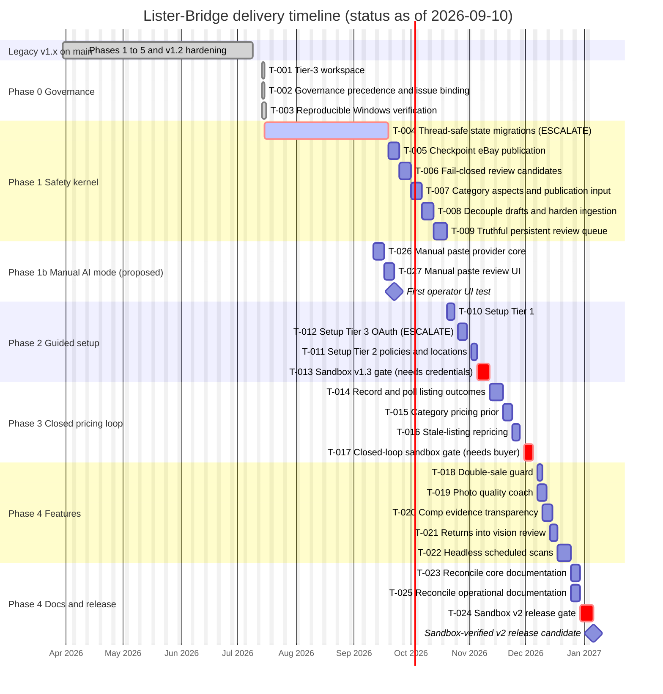

# Lister-Bridge Hybrid Agent

An automated market research and eBay listing tool. Monitors Google Drive for incoming
item photos, uses Gemini Multimodal Vision to extract details and establish a
GMV-optimized "Margin-Guard" price, and uses a Streamlit review/approve interface to
resolve ambiguities before publishing directly to eBay via the REST Sell Inventory API.

---

## Development Status

Roadmap work runs on the `tier3-v2-roadmap` branch; `main` is the protected v1.2 legacy
baseline. Task status of record is `.team/PLAN.md`; resumable context is `.team/STATE.md`.
Bars to the right of the today marker are working-day projections that assume the
pending owner decisions land this week. They are estimates, not commitments.



Legend: grey bars are done; the highlighted bar is in progress; red bars are escalation or
live-sandbox gates that need an owner decision or external credentials.

---

## Success Criteria

| Metric | Target |
|---|---|
| Margin & Velocity | `marginGuardPrice` achieves >80% 30-day sell-through rate |
| Data Accuracy | Zero listings flagged by eBay for inaccurate Item Specifics |
| Vision Reliability | Vision Agent identifies ≥95% of visible physical defects |

---

## Architecture Overview

The system is a Python-based application with a Streamlit review/approve front end. The
**Orchestrator** polls a designated Google Drive folder for new item batches. For each
item, the **Vision Agent** (Gemini `media_resolution: HIGH`) extracts visual data, and
the **Logic Agent** (Gemini `thinking_level: HIGH`) calculates the Margin-Guard price.

If data is missing, the operator resolves it in the Streamlit review UI alongside the
photos, extracted specifics, and suggested price. Once the operator clicks **Approve**,
the payload is pushed to eBay via the REST Sell Inventory publish sequence
(`createInventoryItem` → `createOffer` → `publishOffer`), with images uploaded first via
the Media API.

---

## Directory Structure

```text
lister-bridge/
├── src/
│   ├── contracts/                # FROZEN pydantic data contracts
│   │   ├── vision.py             # VisionAgentOutput (Vision -> Margin-Guard)
│   │   ├── pricing.py            # MarginGuardOutput + ActiveCompRange
│   │   ├── ebay.py               # ListingPayload + REST bodies + result shapes
│   │   ├── adapter.py            # AdapterCapability + DraftOutput
│   │   └── state.py              # ItemRecord / ItemStatus / TokenCacheRecord
│   ├── core/
│   │   ├── orchestrator.py       # Sequencing, per-item state, Drive API integration
│   │   ├── drive_fetcher.py      # Handles Google Drive IO
│   │   ├── state_store.py        # SQLite dedup/resume + token cache
│   │   └── paths.py              # Frozen-aware .env / data-dir resolution
│   ├── ai/
│   │   ├── provider.py           # Swappable AI provider interface (Gemini default)
│   │   ├── vision_agent.py       # High-res image ingestion & Gemini extraction
│   │   └── margin_guard.py       # Pricing logic and market analysis
│   ├── api/
│   │   ├── ebay_auth.py          # OAuth refresh -> cached access token
│   │   └── ebay_client.py        # Media upload + REST Sell Inventory publish + Browse comps
│   ├── marketplace/               # MarketplaceAdapter layer (v1.2)
│   │   ├── base.py               # MarketplaceAdapter / AutoPublishAdapter / DraftAdapter
│   │   ├── ebay_adapter.py       # Auto-publish adapter wrapping ebay_client
│   │   └── other_adapter.py      # Draft-only adapter (Facebook Marketplace, Mercari, ...)
│   └── ui/
│       ├── app.py                 # Streamlit review/approve front end (the human gate)
│       └── review.py              # Pure, Streamlit-free review/validation helpers
├── desktop_app.py                 # Desktop entry point — launches the Streamlit GUI
├── packaging/
│   └── lister_bridge.spec         # PyInstaller spec for the standalone .exe
├── scripts/
│   ├── build_desktop.py           # Builds dist/lister-bridge.exe
│   └── ebay_sandbox_spike.py      # Live/mocked end-to-end eBay de-risk runner
├── tests/
├── docs/
│   ├── FMEA.md
│   ├── KANBAN_SETUP.md
│   ├── templates/
│   └── proposals/
├── working/                     # Ephemeral per-session scratch space
│   ├── CODE_DECISIONS_PATCH.md
│   ├── ISSUE_QUEUE.md
│   └── DOCUMENT_DRIFT_LOG.md
├── .github/
│   └── workflows/
│       └── spike-check.yml
├── CLAUDE.md
├── CONTRIBUTING.md
├── ARCHITECTURE.md
├── CONSTRAINTS.md
├── KEY_DECISION_LOG.md
├── CODE_DECISION_LOG.md
├── .env                         # SECURE — Never commit
├── .repomixignore
├── repomix.config.json
├── requirements.txt
└── README.md
```

---

## Operational Ground Rules

| # | Rule | Mechanism |
|---|---|---|
| 1 | **Issue Binding** — No code or documentation generated without an active, assigned Issue. | PR template requires Issue reference. |
| 2 | **Decision Logging** — Architectural decisions → `KEY_DECISION_LOG.md`. Code decisions → `working/CODE_DECISIONS_PATCH.md`. Merged into `CODE_DECISION_LOG.md` at HUMAN gate. | PR review checklist. |
| 3 | **State Synchronization** — AI explicitly states Kanban column changes at start and end of each action. | Prompt headers include State Sync section. |
| 4 | **Source Truth** — `ARCHITECTURE.md` updated concurrently with any structural change. | PR review checklist. |
| 5 | **Constraint Traceability** — Decisions impacting FMEA reference the FMEA ID. | FMEA labels on Issues. |
| 6 | **Template Adherence** — AI must read templates before generating files. No memory reconstruction. | Embedded in workflow. |
| 7 | **[SPIKE] Exemption** — Spike issues bypass structural requirements. Formalization required before Done. | `spike` label + Kanban Done-lock enforced by `spike-check.yml`. |
| 8 | **Execution-Locked FMEA** — FMEA constraints are immutable during task execution. | Prompt headers cite constraints with immutability notice. |
| 9 | **FMEA Amendment Protocol** — Constraint conflicts halt execution for human review. | FMEA Amendment Proposal template. |
| 10 | **Codebase State Sync** — Fresh repository map required at start of execution sessions. | Prompt header preamble check. |
| 11 | **Code Comment Standard** — All `.py` files must include module-level docstrings, function docstrings, and plain-English block comments. AI sessions must not remove or truncate existing comments. | Enforced via `CONSTRAINTS.md` C-004–C-007. Standing acceptance criterion. |

---

## Setup

1. Copy `.env.example` to `.env` and populate credentials (Gemini API key, Google Service Account JSON path, eBay OAuth tokens).
2. Install dependencies: `pip install -r requirements.txt`
3. Run the GUI: `streamlit run src/ui/app.py` — or headless: `python -m src.core.orchestrator`

## Marketplaces (v1.2)

The approve step routes a listing to a selectable target via the `MarketplaceAdapter` layer (`src/marketplace/`):

- **eBay** — auto-publish (Media upload → REST `createInventoryItem`/`createOffer`/`publishOffer`).
- **Other (draft)** — generic draft-only adapter that writes a platform-tailored posting + photo manifest to disk for manual posting. Templates ship for **Facebook Marketplace** and **Mercari**; add a platform by adding one entry to `_PLATFORM_TEMPLATES` in `src/marketplace/other_adapter.py`. **Etsy** is a future auto-publish candidate.

Drafts are written under `DRAFT_OUTPUT_DIR` (default `data/drafts/<item_sku>/<platform>/`).

## Desktop build (single .exe, v1.2)

Produce a standalone Windows executable that launches the Streamlit GUI in a native window (pywebview + PyInstaller, via `streamlit-desktop-app`):

```bash
pip install -r requirements.txt -r requirements-build.txt
python scripts/build_desktop.py            # -> dist/lister-bridge.exe
```

Reproducible alternative (hand-authored spec):

```bash
pyinstaller packaging/lister_bridge.spec   # -> dist/lister-bridge.exe
```

Dev run without packaging: `python desktop_app.py`. Build dependencies live in `requirements-build.txt` and are **not** required to run the app or the tests.
