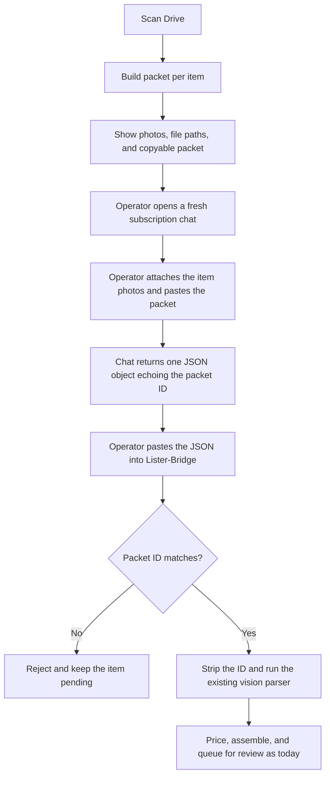

# Proposal — v2.1 Manual Paste AI Provider

**Purpose:** let an operator run Vision extraction through any subscription chat (ChatGPT, Claude, Gemini web) by copying a rendered prompt packet out of Lister-Bridge and pasting the model's JSON reply back in, with no Gemini API key and no per-call API spend.

**Status:** proposed 2026-09-10 at the owner's request. Bound to PLAN tasks T-026 (core) and T-027 (UI). GitHub issues are queued in `working/ISSUE_QUEUE.md` and require owner authorization before either task goes `IN-FLIGHT` (Ground Rule 1). FMEA Amendment 6 (Section 4) must be approved first (Ground Rule 9).

**Precedent:** the Machine Interview repository's `manual_chatgpt_adapter` renders a self-contained launch packet with a bound manifest ID, the moderator pastes it into a fresh chat, and the chat's structured JSON report is imported by hand. This proposal ports that two-surface pattern to Lister-Bridge's `AIProvider` seam.

---

## 1. Why

- **Cost.** Consumer Google One and AI Pro plans exclude API tokens; the API is billed separately (already stated in `src/core/settings.py` help text). The owner holds subscription chats and prefers to use them.
- **Onboarding.** A new operator can run the full review flow before obtaining any AI credential. Setup Tier 1 (T-010) shrinks for manual-mode users.
- **Vendor independence.** The packet is plain text plus photos, so any capable multimodal chat works. Nothing in the pipeline changes when the operator switches chats.
- **Safety parity.** The packet embeds the existing extraction prompt and the reply goes through the unchanged `vision_agent` parser, so PI-004 (forced `defects_found`) and PI-005 (drop, never invent) hold exactly as they do for Gemini.

## 2. Two-surface workflow

The application never drives the chat. The operator carries text and photos across the boundary in both directions.

The packet ID check is the one new control. Without it an operator working several items in parallel can paste item A's reply against item B, which is the manual analogue of PI-013 misattribution.

## 3. Design

### 3.1 Components

| Component | Location | Responsibility |
|---|---|---|
| `ManualPacket` | `src/ai/manual_provider.py` | Frozen dataclass: `packet_id`, `prompt_text`, `image_paths`, `operator_checklist`, `adapter_version`. |
| `build_packet()` | `src/ai/manual_provider.py` | Deterministic packet from the frozen extraction prompt, sorted image file names, and adapter version. ID is a SHA-256-derived UUID over that content. |
| `parse_manual_response()` | `src/ai/manual_provider.py` | Parses the pasted text, verifies the echoed `packet_id`, strips it, returns JSON text for `vision_agent`. Fails closed on missing or wrong ID. |
| `ManualProvider` | `src/ai/manual_provider.py` | Implements `AIProvider`. Looks up a stored response by packet ID; returns it when present, raises `ManualResponsePending(packet)` when absent. `model_name` is `manual-paste`. |
| `ScanSummary.pending` | `src/core/orchestrator.py` | New list of pending manual items (SKU, folder, packet). Item status stays `NEW`, not `ERROR`, so a rescan retries. |
| `AI_PROVIDER` setting | `src/core/settings.py`, `.env.example` | `gemini` (default) or `manual`. Manual mode removes `GEMINI_API_KEY` from `missing_required`. |
| Review UI | `src/ui/app.py`, `src/ui/help_content.py` | Pending card: photos with paths, packet in a copyable code block, paste area, "Use response" action, human-readable rejection messages. |

### 3.2 Packet contents

1. Role line and the frozen extraction instructions from `vision_agent._EXTRACTION_PROMPT`, verbatim.
2. The sorted list of photo file names the operator must attach, with a count.
3. The packet ID and the instruction to include `"packet_id": "<id>"` in the JSON reply.
4. A reminder to start a new chat per item and to return only the JSON object.

### 3.3 Fail-closed rules

- A reply without the exact packet ID is rejected before any contract parsing.
- A reply that parses but fails `VisionAgentOutput` validation surfaces the existing `ValueError` path and leaves the item pending.
- Stored responses live in the Streamlit session only. Persisting them is T-006 `ReviewCandidate` scope, not this proposal.
- The provider stays stateless per call (PI-003): one packet, one reply, no chat memory assumed.

## 4. Governance

### 4.1 FMEA Amendment 6 (proposed)

| ID | Failure mode and effect | S/O/D (RPN) | Mitigation | Owner |
|---|---|---|---|---|
| PI-014 | A manually pasted model reply is attributed to the wrong item, producing a listing whose specifics and defects describe a different object. | 7/4/3 (84) | Deterministic packet ID embedded in the prompt, echoed in the reply, and verified before parsing; mismatches reject and keep the item pending. | AI/UI Eng |

This row is additive. No existing score, control, or status changes.

### 4.2 Boundaries

- No clipboard automation and no browser control. Streamlit's code block provides the copy affordance.
- Photos leave the machine under the operator's chat subscription terms, exactly as they do under the Gemini API today. The Help tab states this.
- Per-chat attachment limits vary by vendor. The packet lists file names so the operator can split large batches; the app does not enforce a cap.
- Manual mode does not change publication, pricing, or state-store behavior. T-004 and T-005 remain the safety kernel.

## 5. Task split

Two tasks keep each builder within the five-primary-file limit and give the owner a UI to test at the end of T-027, which is the first operator test point per the 2026-09-10 decision.

| Task | Files | Exit |
|---|---|---|
| T-026 core | `src/ai/manual_provider.py`, `src/core/orchestrator.py`, `src/core/settings.py`, `.env.example`, `tests/test_manual_provider.py` | Packet, provider, pending path, and settings tested without Streamlit or the Gemini SDK. |
| T-027 UI | `src/ui/app.py`, `src/ui/help_content.py`, `src/ui/review.py`, `tests/test_help_content.py`, `tests/test_review.py` | Pending cards, paste flow, Help section, and first operator UI test. |

Acceptance criteria are recorded in `.team/PLAN.md` under T-026 and T-027.

## 6. Out of scope

- Automatic import from a chat export file.
- Manual mode for Margin-Guard comps; pricing remains eBay Browse or operator input.
- Persisting pasted responses across restarts (deferred to T-006).
- Any change to the frozen `src/contracts/` models.

This changes if the owner obtains a Gemini API key and prefers the automated path, or if a chat vendor blocks pasted structured prompts.

---

## HFE review

- [x] Chunking: no list or table exceeds seven items; the diagram has eleven nodes.
- [x] Signal-to-noise: each section supports a decision, a control, or a boundary.
- [x] Signaling: bold marks only the document status fields and the first use of the four rationale terms.
- [x] Contiguity: each component's responsibility sits in the same table row; the ID control is explained beside the diagram.
- [x] Redundancy: the diagram carries the sequence; prose adds only the rationale for the ID check.
- [x] Dual-channel: the two-surface procedure has a flowchart.
- [x] Progressive disclosure: purpose and status precede rationale, design, governance, and scope.
